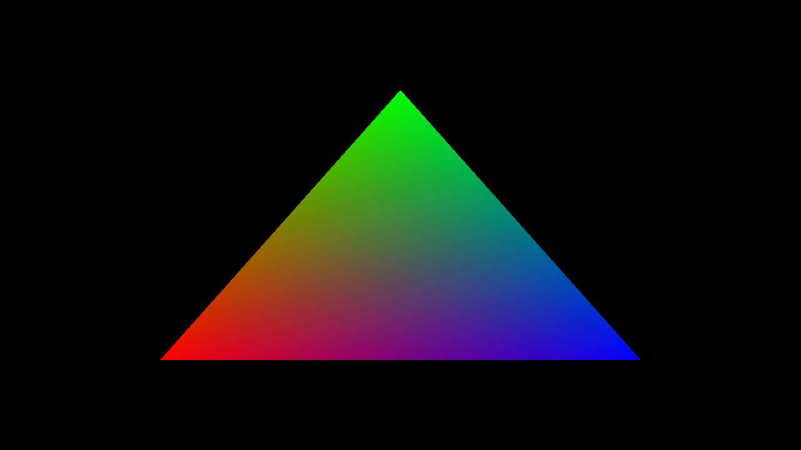
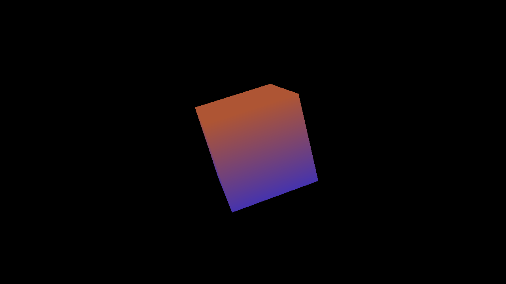
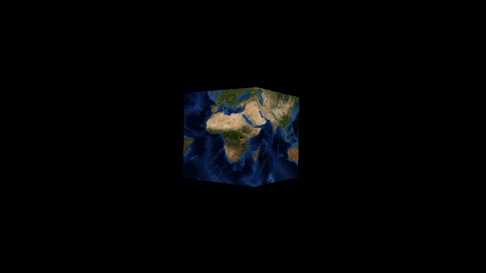

# GMG

GMG (give me graphics) is a graphics abstraction on top of low level graphics APIs such as Vulkan. You can think of this library as a slightly lower level explicit OpenGL.

This library is still in it's infant stages and needs a game project to test out the API. That being said, there are simple examples to view and I am working on a 3D game that uses this library. The core structure of the library should not change but there will be additions and small breakages.

Currently the only backend implemented right is Vulkan since this is the most cross platform API. In future I would like to add support for DirectX 12 and Metal.

# Features
- Minimal dependencies
	- only using the DAS library right now but can be removed in future.
- Compiles as C99
- Backend for Vulkan

# Usage

Everywhere you need to use this library, put this at the top of the file:
```
#include "gmg.h"
```
In a single compilation unit, include the source file.
```
#include "gmg.c"
```

# Documentation

Right now there is no documentation as the library is being finalized but there are 3 simple examples to use.

see the examples directory for:
- triangle
- cube
- textured_cube

# Screenshots

### Triangle Example


### Cube Example


### Textured Cube Example

